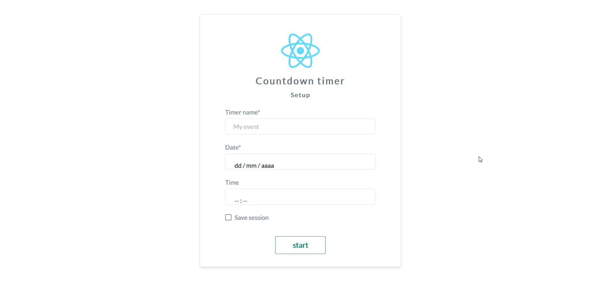

# Countdown timer :stopwatch:

The objective of Countdown Timer is to provide a continuously decrementing display of the months, days, hours, minutes, and seconds to a user entered event.

## User stories :clipboard:
- [x] User can see an alert when the event is reached
- [x] User can see a warning message if the time until the event data and time that has been entered would overflow the precision of the countdown timer.
- [x] User can see an event input box containing an event name field, an date field, an optional time, and a 'Start' button.
- [x] User can see the elements in the countdown timer automatically decrement.
- [x] User can see a warning message if the event date or time are incorrectly entered.
- [x] User can save the event so that it persists across sessions.
- [x] User can define the event by entering its name, the date it is scheduled to take place, and an optional time of the event.
- [x] User can click on the 'Start' button to see the countdown timer start displaying the days, hours, minutes, and seconds until the event takes place.

## Preview :fire:

## Demo :joystick:
Demo available [here](https://reactcountdown.web.app/)

## Technologies :hammer_and_wrench:
> 
> 
> 
> 
> 
> 
> 
> 
> 
> 
> 
> 

## Run locally :computer:
The command `npm start` runs the app in the development mode.
Open [http://localhost:3000](http://localhost:3000) to view it in the browser.

## License :memo:
This project is under the MIT license
